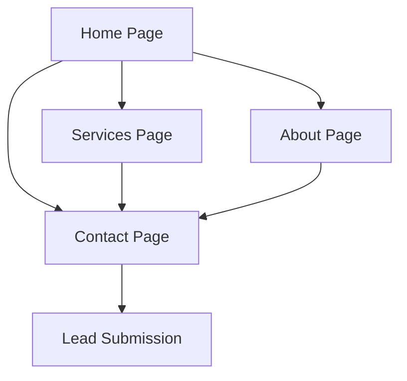

## 1. Product Overview

Bonbon Design is a premium web design agency offering 7-day high-end website sprints for Brisbane businesses. The website showcases their service offering of delivering professional 5-page Framer websites in just 7 days for $2,400, targeting busy business owners who value speed and corporate-grade quality.

The product solves the problem of lengthy web development timelines by providing a fast, fixed-price service with no lock-in contracts, delivering high-end results quickly.

## 2. Core Features

### 2.1 User Roles
No user registration or authentication is required for this marketing website. All visitors are public users who can browse content and contact the business.

### 2.2 Feature Module

The Bonbon Design website consists of the following main pages:

1. **Home page**: hero section with value proposition, services overview, social proof, and contact call-to-action.
2. **Services page**: detailed breakdown of the 5-page website package, timeline, pricing, and process.
3. **About page**: company story, team information, and design philosophy.
4. **Contact page**: contact form, booking system, and business information.

### 2.3 Page Details

| Page Name | Module Name | Feature description |
|-----------|-------------|---------------------|
| Home page | Hero Section | Display headline "7-Day High-End Website Sprints Brisbane", value proposition, and primary CTA button. |
| Home page | Navigation | Sticky navigation bar with logo and menu items, blur background effect on scroll. |
| Home page | Services Overview | Showcase the 5-page website package with timeline (7 days) and pricing ($2,400). |
| Home page | Social Proof | Display client logos (Dominos, Entain, Neds) in a marquee or grid layout. |
| Home page | Process Timeline | Visual representation of the 7-day sprint process. |
| Home page | Contact CTA | Prominent contact/booking button leading to contact page. |
| Services page | Package Details | Detailed breakdown of what's included in the 5-page website package. |
| Services page | Timeline Breakdown | Day-by-day breakdown of the 7-day sprint process. |
| Services page | Pricing Information | Clear pricing structure and payment terms. |
| Services page | Portfolio Gallery | Examples of previous work or case studies. |
| About page | Company Story | Narrative about Bonbon Design's mission and approach. |
| About page | Team Information | Information about the design team and expertise. |
| About page | Design Philosophy | Explanation of the company's design principles. |
| Contact page | Contact Form | Form for potential clients to submit inquiries. |
| Contact page | Booking System | Calendar integration or booking mechanism for consultations. |
| Contact page | Business Information | Address, phone, email, and business hours. |

## 3. Core Process

The main user flow is a simple marketing website journey where visitors learn about the service and convert into leads:

1. Visitor lands on homepage from search or referral
2. Visitor reads hero section and value proposition
3. Visitor scrolls to learn about services and process
4. Visitor sees social proof from major clients
5. Visitor clicks CTA to contact or book consultation
6. Visitor fills out contact form or booking system
7. Business receives lead notification

## 4. User Interface Design

### 4.1 Design Style
- **Primary Colors**: Deep purple (#6214d9), white (#ffffff), off-white background (#fbfafc)
- **Secondary Colors**: Light green accent (#1aff75), dark text (#0d0d0d), muted gray (#928d89)
- **Typography**: 
  - Headlines: "Instrument Serif" for elegant, premium feel
  - Body text: "Inter" for readability
  - Accent text: "Satoshi" for modern touch
- **Button Style**: Rounded corners with gradient backgrounds, hover effects
- **Layout Style**: Card-based sections with generous whitespace, grainy gradient backgrounds
- **Icon Style**: Minimalist line icons, possibly animated Lottie files

### 4.2 Page Design Overview

| Page Name | Module Name | UI Elements |
|-----------|-------------|-------------|
| Home page | Hero Section | Full-width hero with grainy gradient background, large serif headline, subheading with value prop, prominent CTA button with hover animation. |
| Home page | Navigation | Semi-transparent blurred navigation bar with rounded edges, logo on left, menu items on right, sticky on scroll. |
| Home page | Services Overview | Three-column grid or card layout showcasing package features, clean white cards with subtle shadows. |
| Home page | Social Proof | Horizontal marquee of client logos (Dominos, Entain, Neds) with smooth scrolling animation. |
| Home page | Process Timeline | Vertical timeline with numbered steps, each day represented as a card with icon and description. |
| Contact page | Contact Form | Clean white form with rounded input fields, validation states, submit button with loading state. |

### 4.3 Responsiveness
Desktop-first design approach with mobile optimization. Breakpoints:
- Desktop: 1200px and above
- Tablet: 810px to 1199px
- Mobile: Below 810px

Touch interaction optimization for mobile devices with appropriately sized tap targets and swipe gestures for carousels.

### 4.4 Animation & Interactions
- Smooth scroll animations using Framer Motion
- Staggered fade-in effects for content sections
- Hover effects on buttons and cards
- Parallax scrolling for background elements
- Micro-interactions on form elements