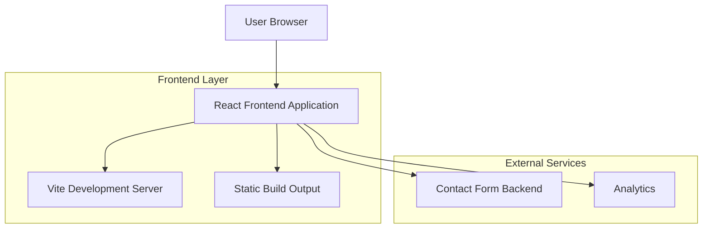

## 1. Architecture Design



## 2. Technology Description

- **Frontend**: React@18 + Tailwind CSS@3 + Vite
- **Initialization Tool**: vite-init
- **Animation Library**: Framer Motion
- **Backend**: None (static site with form integration)
- **Deployment**: Static hosting (Vercel/Netlify)

### Essential Dependencies
- react@18.2.0
- react-dom@18.2.0
- framer-motion@10.16.0
- tailwindcss@3.3.0
- autoprefixer@10.4.0
- postcss@8.4.0
- @vitejs/plugin-react@4.0.0
- vite@4.4.0

### Development Dependencies
- eslint@8.45.0
- prettier@3.0.0

## 3. Route Definitions

| Route | Purpose |
|-------|---------|
| / | Home page with hero section, services overview, social proof, and contact CTA |
| /services | Detailed services page with package breakdown and timeline |
| /about | About page with company story and team information |
| /contact | Contact page with form and booking system |
| /portfolio | Portfolio gallery showcasing previous work (optional) |

## 4. Component Architecture

### 4.1 Core Components
- **Layout Components**:
  - `Header`: Navigation with sticky behavior and blur effects
  - `Footer`: Site footer with contact information
  - `Layout`: Main layout wrapper

- **Page Components**:
  - `HomePage`: Hero, services, social proof, process timeline
  - `ServicesPage`: Package details, timeline breakdown
  - `AboutPage`: Company story, team info
  - `ContactPage`: Contact form, booking system

- **UI Components**:
  - `Button`: CTA buttons with hover animations
  - `Card`: Service cards with shadow effects
  - `Timeline`: Process timeline component
  - `Marquee`: Client logos scrolling animation
  - `ContactForm`: Form with validation
  - `HeroSection`: Full-width hero with gradient background

### 4.2 Asset Management
- Images stored in `/public/images/`
- Client logos in `/public/images/clients/`
- Gradient backgrounds in `/public/images/gradients/`
- Fonts loaded via CSS @font-face declarations

## 5. Performance Optimization

### 5.1 Image Optimization
- Use next-gen formats (WebP, AVIF) with fallbacks
- Implement lazy loading for images below the fold
- Optimize gradient backgrounds for web delivery

### 5.2 Code Splitting
- Route-based code splitting with React.lazy()
- Component-level splitting for heavy components
- Preload critical resources

### 5.3 Build Optimization
- Tree shaking enabled in Vite
- CSS purging with Tailwind
- Asset compression and minification

## 6. SEO & Meta Tags

### 6.1 Meta Tags
- Dynamic meta tags for each route
- Open Graph tags for social sharing
- Structured data for local business

### 6.2 Performance Metrics
- Core Web Vitals optimization
- Lighthouse score target: 90+
- First Contentful Paint < 1.5s

## 7. Form Integration

### 7.1 Contact Form
- Formspree or Netlify Forms integration
- Client-side validation
- Success/error state handling
- Spam protection (honeypot field)

### 7.2 Booking System
- Calendly or similar embedded booking
- Custom booking form with date/time selection
- Email notifications to business

## 8. Analytics & Tracking

### 8.1 Analytics Integration
- Google Analytics 4
- Conversion tracking for contact forms
- Scroll depth tracking
- CTA click tracking

### 8.2 UTM Parameter Handling
- Store UTM parameters in localStorage
- Append to contact form submissions
- Track marketing campaign effectiveness

## 9. Deployment Configuration

### 9.1 Build Process
```bash
npm run build    # Production build
npm run preview  # Preview production build
npm run dev      # Development server
```

### 9.2 Environment Variables
- `VITE_SITE_URL`: Site URL for meta tags
- `VITE_CONTACT_FORM_ENDPOINT`: Form submission endpoint
- `VITE_ANALYTICS_ID`: Google Analytics ID

### 9.3 Hosting Requirements
- Static file hosting (Netlify, Vercel, Cloudflare Pages)
- CDN for global asset delivery
- Custom domain support
- SSL certificate

## 10. Browser Support

### 10.1 Target Browsers
- Chrome 90+
- Firefox 88+
- Safari 14+
- Edge 90+

### 10.2 Fallbacks
- CSS Grid fallbacks for older browsers
- Font loading fallbacks
- Image format fallbacks